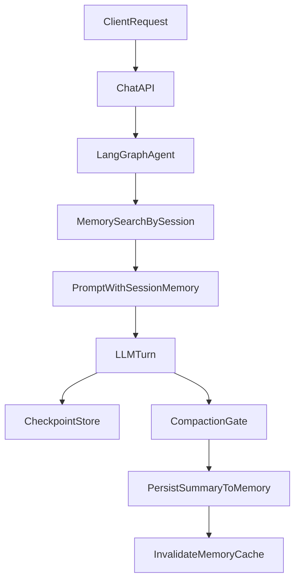

# Stabilize Local Prototype

## What I found
- The new cache layer exists in [`/home/faiq0913/gitops-argocd-k8s-fastapi/services/backend/app/core/cache.py`](/home/faiq0913/gitops-argocd-k8s-fastapi/services/backend/app/core/cache.py), but the backend lifespan in [`/home/faiq0913/gitops-argocd-k8s-fastapi/services/backend/app/main.py`](/home/faiq0913/gitops-argocd-k8s-fastapi/services/backend/app/main.py) never initializes it, so Redis-backed caching would stay inactive even when `REDIS_HOST=redis`.
- The long-term memory service in [`/home/faiq0913/gitops-argocd-k8s-fastapi/services/backend/app/services/memory.py`](/home/faiq0913/gitops-argocd-k8s-fastapi/services/backend/app/services/memory.py) is not wired into the live chat path in [`/home/faiq0913/gitops-argocd-k8s-fastapi/services/backend/app/api/v1/chat.py`](/home/faiq0913/gitops-argocd-k8s-fastapi/services/backend/app/api/v1/chat.py) or [`/home/faiq0913/gitops-argocd-k8s-fastapi/services/backend/app/core/langgraph/graph.py`](/home/faiq0913/gitops-argocd-k8s-fastapi/services/backend/app/core/langgraph/graph.py).
- Backend dependencies in [`/home/faiq0913/gitops-argocd-k8s-fastapi/services/backend/pyproject.toml`](/home/faiq0913/gitops-argocd-k8s-fastapi/services/backend/pyproject.toml) do not currently include `redis`, so Compose can start a Redis container but the backend still falls back to in-process cache.
- The ingestion worker is configured in [`/home/faiq0913/gitops-argocd-k8s-fastapi/docker-compose.yaml`](/home/faiq0913/gitops-argocd-k8s-fastapi/docker-compose.yaml) with mandatory NVIDIA device reservations, while the actual worker code in [`/home/faiq0913/gitops-argocd-k8s-fastapi/services/ingestion/pipeline/extraction.py`](/home/faiq0913/gitops-argocd-k8s-fastapi/services/ingestion/pipeline/extraction.py) already uses `AcceleratorDevice.AUTO`, so Compose can be made GPU-optional without removing the worker.

## Planned changes
1. Harden local startup and Compose behavior.
   - Make the ingestion worker start even on machines without GPU access by relaxing the Compose GPU reservation while preserving the service.
   - Review backend container startup in [`/home/faiq0913/gitops-argocd-k8s-fastapi/services/backend/Dockerfile`](/home/faiq0913/gitops-argocd-k8s-fastapi/services/backend/Dockerfile) and [`/home/faiq0913/gitops-argocd-k8s-fastapi/services/backend/scripts/docker-backend-entrypoint.sh`](/home/faiq0913/gitops-argocd-k8s-fastapi/services/backend/scripts/docker-backend-entrypoint.sh) for any local-env mismatch that blocks `docker compose up --env-file envs/.env.local`.
   - Run the local stack and fix the concrete runtime failures until `postgres`, `redis`, `rabbitmq`, `minio`, `backend`, and `ingestion-worker` all come up cleanly.

2. Finish activating Redis cache in the backend.
   - Add the Redis client dependency to [`/home/faiq0913/gitops-argocd-k8s-fastapi/services/backend/pyproject.toml`](/home/faiq0913/gitops-argocd-k8s-fastapi/services/backend/pyproject.toml).
   - Initialize and close the cache service from the FastAPI lifespan in [`/home/faiq0913/gitops-argocd-k8s-fastapi/services/backend/app/main.py`](/home/faiq0913/gitops-argocd-k8s-fastapi/services/backend/app/main.py).
   - Keep the in-memory fallback intact for non-Compose runs where `REDIS_HOST` is unset.

3. Wire session-scoped long-term memory into the live chat flow.
   - Keep `session_id` as the only identity key for now; do not introduce `user_id` behavior yet.
   - Initialize `memory_service` during backend startup so mem0/pgvector is warm before first request.
   - Integrate memory retrieval into the LangGraph request path in [`/home/faiq0913/gitops-argocd-k8s-fastapi/services/backend/app/core/langgraph/graph.py`](/home/faiq0913/gitops-argocd-k8s-fastapi/services/backend/app/core/langgraph/graph.py), using `session_id` to fetch relevant long-term memory and pass it into the prompt/context.
   - Update the post-response path so successful turns can be added back into [`/home/faiq0913/gitops-argocd-k8s-fastapi/services/backend/app/services/memory.py`](/home/faiq0913/gitops-argocd-k8s-fastapi/services/backend/app/services/memory.py), with cache invalidation for stale search results if needed.

4. Add compaction that feeds long-term memory.
   - Implement a session-level compaction trigger in [`/home/faiq0913/gitops-argocd-k8s-fastapi/services/backend/app/core/langgraph/graph.py`](/home/faiq0913/gitops-argocd-k8s-fastapi/services/backend/app/core/langgraph/graph.py), based on conversation size/history thresholds suitable for a local prototype.
   - When the threshold is crossed, summarize older checkpointed conversation into a compact session summary and persist that summary into [`/home/faiq0913/gitops-argocd-k8s-fastapi/services/backend/app/services/memory.py`](/home/faiq0913/gitops-argocd-k8s-fastapi/services/backend/app/services/memory.py) under the same `session_id`.
   - Use compaction to reduce checkpoint/history growth while preserving important context through long-term memory, rather than introducing user-scoped partitions.
   - Add a few config knobs in [`/home/faiq0913/gitops-argocd-k8s-fastapi/services/backend/app/core/config.py`](/home/faiq0913/gitops-argocd-k8s-fastapi/services/backend/app/core/config.py) so the compaction threshold and behavior can be tuned locally.

5. Verify the prototype end to end.
   - Bring the local stack up with the local env file.
   - Confirm backend startup, health, and a basic session/chat flow.
   - Confirm Redis is actually used, long-term memory initialization succeeds, and the ingestion worker stays alive without mandatory GPU access.
   - Run targeted lint/tests for touched backend files and fix any new diagnostics.

## Intended flow after implementation

## Notes
- I’ll treat the initial success bar as: `docker compose up` works with `envs/.env.local`, the worker remains part of the stack, Redis is truly live, and chat memory stays session-scoped.
- If runtime errors reveal additional container-specific issues beyond the code paths above, I’ll fix them as part of the same stabilization pass rather than splitting them into a separate task.