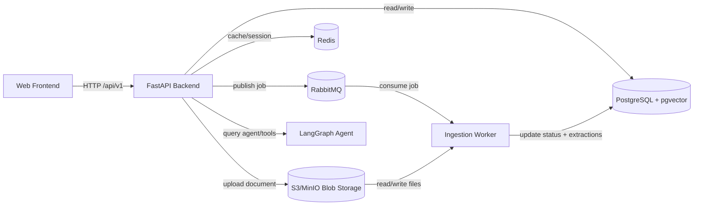

# Harness Engineering with Malaysian Road Transport Legal Researcher Agents on AKS (Azure Kubernetes Service)

> This project is a work in progress (due to a lot of moving parts!).

This repository contains code for building a team of Malaysian Road Transport Legal Researcher Agents. We take important legal documents, list of fines and penalties, equip the Agents with internet search in order for it to be a useful pseudo-legal advisor. **Please obey the law and be careful while driving!**

Also, I built this primarily to gain experience in [Harness Engineering](https://www.anthropic.com/engineering/harness-design-long-running-apps), Azure DevOps & Terraform, as well as GitOps.

## What makes a good Harness?

| Harness Component | Have we built this? | Point to specific file |
| --- | --- | --- |
| While Loop & Context Control | ✅ | `services/backend/app/core/langgraph/graph.py` |
| Tools & Skills | ✅ | `services/backend/app/core/langgraph/tools/__init__.py`, `services/backend/app/core/langgraph/skills/statute_analysis/SKILL.md` |
| Session Persistence | ✅ | `services/backend/app/core/langgraph/graph.py` |
| Lifecycle Hooks (e.g., pre/post-tool) | Partial | `services/backend/app/core/langgraph/filesystem_middleware.py` |
| Subagents | No (not explicit yet) | `services/backend/app/core/langgraph/graph.py` |
| Memory, Prompts & Hooks | ✅ | `services/backend/app/services/memory.py`, `services/backend/app/core/langgraph/graph.py` |
| Permissions and Safety Layer | Partial | `services/backend/app/core/langgraph/filesystem_middleware.py`, `services/backend/app/core/langgraph/tools/regulation_db_query.py` |
| Built-in Skills | ✅ | `services/backend/app/core/langgraph/skills/canned_responses/SKILL.md` |
| Dynamic System Prompt Assembly | Partial | `services/backend/app/core/langgraph/graph.py` |
| Context Management (e.g., compaction) | ✅ | `services/backend/app/core/langgraph/graph.py` |

Here's a rough architecture of the frontend/backend where the harness is used.

## Deployment Layout

- `infra/terraform/bootstrap/`: creates the remote-state resource group, storage account, and container.
- `infra/terraform/platform/`: provisions AKS, ACR, PostgreSQL Flexible Server, Blob Storage, Key Vault, ingress, Argo CD, External Secrets, and the S3-compatible gateway VM.
- `infra/terraform/environments/{dev,prod}/`: environment composition and example inputs.
- `deploy/k8s/base/`: app-only Kubernetes base manifests.
- `deploy/k8s/overlays/{local,development,production}/`: local and Azure-backed app overlays.
- `deploy/platform/overlays/{development,production}/`: platform manifests such as the Key Vault-backed `ClusterSecretStore` and RabbitMQ.
- `deploy/argocd/`: root and child Argo CD applications.
- `.github/workflows/`: CI, ACR image publishing, and image-promotion workflows.

## GitOps Flow

1. Terraform provisions Azure resources and bootstraps Argo CD plus cluster add-ons.
2. Apply either `deploy/argocd/root-application-development.yaml` or `deploy/argocd/root-application-production.yaml` once so each AKS cluster only manages its own environment.
3. GitHub Actions builds and pushes images to ACR.
4. The promotion workflow updates Kustomize image tags, and Argo CD syncs the matching environment.

## Notes

- `development` and `production` overlays no longer deploy in-cluster PostgreSQL or MinIO.
- Secrets are expected to come from Azure Key Vault via External Secrets.
- The local overlay keeps PostgreSQL, RabbitMQ, and MinIO for developer parity.
- Replace `replace-me.azurecr.io` in the Azure-backed overlays with the ACR login server created by Terraform before syncing them.

# Resources

- [What is an Agent Harness? and How to build a great one!](https://www.youtube.com/watch?v=nWzXyjXCoCE) e.g., while loop, skills (markdown-based) & tools, built-in skills, system prompt assembly, permission & safety, sub-agents, context management, session persistence, lifecycle hooks
- [Awesome Cursor Rules](https://github.com/PatrickJS/awesome-cursorrules/tree/main/rules/py-fast-api)
- Skills (for [progressive disclosure](https://docs.claude-mem.ai/progressive-disclosure#what-is-progressive-disclosure))
  - [Statute Analysis by Rafael Fryc](https://github.com/lawvable/awesome-legal-skills/tree/main/skills%2Fstatute-analysis-rafal-fryc)
  - [Canned Responses by Anthropic](https://github.com/lawvable/awesome-legal-skills/tree/main/skills/canned-responses-anthropic)
- Can someone help me understand, the use/need for an OCR engine when using something like granite-docling? ([docling-project/docling#2726](https://github.com/docling-project/docling/discussions/2726))
- [Prompting for frontend aesthetics](https://platform.claude.com/cookbook/coding-prompting-for-frontend-aesthetics)