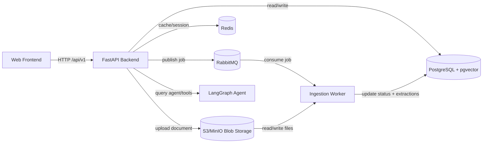

# Backend (`services/backend`)

## a) System architecture
- FastAPI app exposes HTTP endpoints (`/api/v1`).
- Startup wires DB, Redis cache, LangGraph agent, RabbitMQ publisher, and object storage bucket checks.
- Uses PostgreSQL (+ pgvector) for relational + vector-aware retrieval workflows.
- Publishes ingestion jobs to RabbitMQ for async document processing.

Sample interaction flow:



## b) Setup commands
```bash
# From repo root: start dependencies + backend container
make up

# Stream backend logs
make backend-logs

# Run DB migrations
make migrate
```

## c) Why these technologies
- **FastAPI**: fast async API development with type-driven request/response handling.
- **PostgreSQL + pgvector**: one data store for transactional and embedding search needs.
- **RabbitMQ**: reliable queueing to decouple user requests from heavy ingestion work.
- **Redis**: low-latency caching/session support for responsive APIs.
- **LangGraph/LangChain stack**: structured orchestration for multi-step agent behavior.
